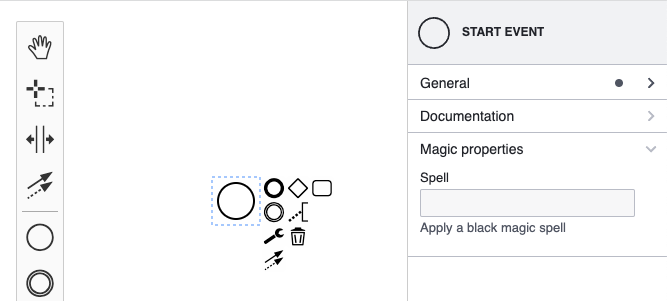

> A extensão do painel de propriedades mudou significativamente a partir do `bpmn-js-properties-panel>=1`. Para a versão `0.x` da biblioteca, confira [a versão antiga deste exemplo](https://github.com/bpmn-io/bpmn-js-examples/tree/b20919ac2231abf3df45b9dc9a2561010009b4a2/properties-panel-extension).

# Exemplo de Extensão do Painel de Propriedades

Este exemplo mostra como estender o [bpmn-js-properties-panel](https://github.com/bpmn-io/bpmn-js-properties-panel) com propriedades personalizadas.



## Sobre

> Se precisar de mais informações sobre configuração, veja primeiro o [exemplo básico de propriedades](../properties-panel).

Neste exemplo, estendemos o painel de propriedades para permitir a edição da propriedade `magic:spell` em todos os eventos de início. Para isso, seguimos os seguintes passos:

* Adicionar um grupo chamado "Black Magic" para conter a propriedade
* Adicionar um campo de texto "spell" a esse grupo
* Criar uma nova extensão moddle

A propriedade `magic:spell` será persistida como uma extensão no documento BPMN 2.0:

```xml
<?xml version="1.0" encoding="UTF-8"?>
<bpmn2:definitions ... xmlns:magic="http://magic" id="sample-diagram">
  <bpmn2:process id="Process_1">
    <bpmn2:startEvent id="StartEvent_1" magic:spell="WOOO ZAAAA" />
  </bpmn2:process>
  ...
</bpmn2:definitions>
```

Vamos detalhar todos os passos necessários.

### Criando um Properties Provider

O primeiro passo para uma propriedade personalizada é criar seu próprio `PropertiesProvider`.
O provider define quais propriedades estão disponíveis e como são organizadas no painel usando abas, grupos e elementos de entrada.

Criamos o [`MagicPropertiesProvider`](src/provider/magic/MagicPropertiesProvider.js), que expõe o grupo "magic" acima das propriedades BPMN existentes. Note que garantimos que o grupo só aparece se um evento de início estiver selecionado.

```javascript
function MagicPropertiesProvider(propertiesPanel, translate) {

  // Registra nosso provider customizado.
  // Use prioridade baixa para garantir que seja carregado após as propriedades básicas do BPMN.
  propertiesPanel.registerProvider(LOW_PRIORITY, this);

  ...

  this.getGroups = function(element) {

    ...

    return function(groups) {

      // Adiciona o grupo "magic"
      if(is(element, 'bpmn:StartEvent')) {
        groups.push(createMagicGroup(element, translate));
      }

      return groups;
    }
  };
}
```

### Definindo um Grupo

Como parte do provider, definimos o grupo magic:

```javascript
// Importe suas entradas customizadas.
// A entrada é um campo de texto com lógica para criar, atualizar e deletar a propriedade "spell".
import spellProps from './parts/SpellProps';

// Cria o grupo customizado magic
function createMagicGroup(element, translate) {

  // cria um grupo chamado "Magic properties".
  const magicGroup = {
    id: 'magic',
    label: translate('Magic properties'),
    entries: spellProps(element),
    tooltip: translate('Make sure you know what you are doing!')
  };

  return magicGroup
}
```

### Definindo uma Entrada

A entrada "spell" é definida em [`SpellProps`](src/provider/magic/parts/SpellProps.js). Reutilizamos [`TextFieldEntry`](https://github.com/bpmn-io/properties-panel/blob/main/src/components/entries/TextField.js) para criar um campo de texto para a propriedade. O `component` precisa ser um componente Preact. Usamos [`htm`](https://github.com/developit/htm) para criar o componente via template.

```javascript
import { html } from 'htm/preact';

import { TextFieldEntry, isTextFieldEntryEdited } from '@bpmn-io/properties-panel';
import { useService } from 'bpmn-js-properties-panel'

export default function(element) {

  return [
    {
      id: 'spell',
      element,
      component: Spell,
      isEdited: isTextFieldEntryEdited
    }
  ];
}

function Spell(props) {
  const { element, id } = props;

  const modeling = useService('modeling');
  const translate = useService('translate');
  const debounce = useService('debounceInput');

  const getValue = () => {
    return element.businessObject.spell || '';
  }

  const setValue = value => {
    return modeling.updateProperties(element, {
      spell: value
    });
  }

  return html`<${TextFieldEntry}
    id=${ id }
    element=${ element }
    description=${ translate('Apply a black magic spell') }
    label=${ translate('Spell') }
    getValue=${ getValue }
    setValue=${ setValue }
    debounce=${ debounce }
    tooltip=${ translate('Check available spells in the spellbook.') }
  />`
}
```

Você pode consultar os [`entries`](https://github.com/bpmn-io/properties-panel/blob/main/src/components/entries/index.js) para encontrar outros componentes de formulário reutilizáveis.

### Criando uma Extensão Moddle

O segundo passo é criar uma extensão moddle para que o moddle reconheça a nova propriedade "spell". Isso é importante para ler e gravar o XML BPMN com propriedades customizadas. A extensão é basicamente um arquivo json [magic.json](src/descriptors/magic.json) contendo a definição de `bpmn:StartEvent#spell`:

```javascript
{
  "name": "Magic",
  "prefix": "magic",
  "uri": "http://magic",
  "xml": {
    "tagAlias": "lowerCase"
  },
  "associations": [],
  "types": [
    {
      "name": "BewitchedStartEvent",
      "extends": [
        "bpmn:StartEvent"
      ],
      "properties": [
        {
          "name": "spell",
          "isAttr": true,
          "type": "String"
        },
      ]
    },
  ]
}
```

Neste arquivo, definimos o novo tipo `BewitchedStartEvent`, que estende `bpmn:StartEvent` e adiciona a propriedade "spell" como atributo.

**Atenção:** É necessário definir no descriptor qual elemento você quer estender. Se quiser que a propriedade seja válida para todos os elementos BPMN, estenda `bpmn:BaseElement`:

```javascript
...

{
  "name": "BewitchedStartEvent",
  "extends": [
    "bpmn:BaseElement"
  ],

  ...
},
```

### Integrando Tudo

Para usar a extensão customizada com o painel de propriedades, é preciso conectar tanto a extensão moddle quanto o provider ao criar o modeler.

```javascript
import BpmnModeler from 'bpmn-js/lib/Modeler';

import {
  BpmnPropertiesPanelModule,
  BpmnPropertiesProviderModule
} from 'bpmn-js-properties-panel';

import magicPropertiesProviderModule from './provider/magic';
import magicModdleDescriptor from './descriptors/magic';

const bpmnModeler = new BpmnModeler({
  container: '#js-canvas',
  propertiesPanel: {
    parent: '#js-properties-panel'
  },
  additionalModules: [
    BpmnPropertiesPanelModule,
    BpmnPropertiesProviderModule,
    magicPropertiesProviderModule
  ],
  moddleExtensions: {
    magic: magicModdleDescriptor
  }
});
```

## Executando o Exemplo

Instale todas as dependências necessárias:

```
npm install
```

Compile e execute o projeto:

```
npm start
```


